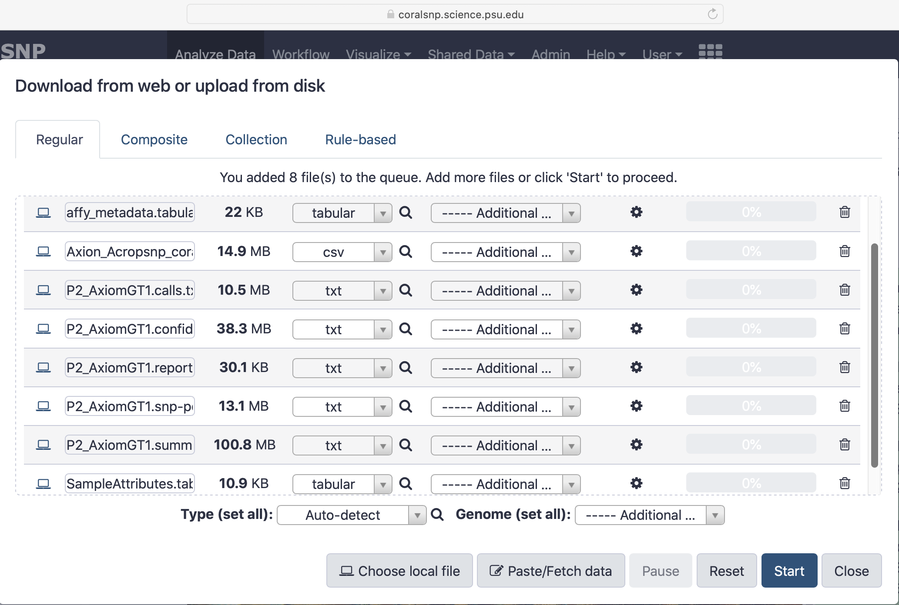

# CoralSNP - a Galaxy analysis environment that includes a 30k SNP genotyping array for Acropora corals and their dinoflagellate symbionts

## Introduction

This document provides information for using the [CoralSNP Galaxy environment](https://coralsnp.science.psu.edu/galaxy)
which is based on the [Galaxy workbench](https://galaxyproject.org/).  A general understanding of Galaxy is required, so please spend some time with the [introductory tutorials](https://training.galaxyproject.org/training-material/topics/introduction) if you are not yet familiar with Galaxy.

The Galaxy CoralSNP environment enables streamlined analysis of the coral SNPchip available from Fisher Scientific to ultimately provide the user with a genet id, converted raw genotyped data, sample relatedness and hybrid status.

The process is straightforward.  Each of the following steps will be discussed in detail in the following sections.

 - A sample metadata file is created by the user from an Excel spreadsheet template for their samples to be analyzed.  A row is entered into the spreadsheet for each sample, and when finished, the spreadsheet is exported from Excel and saved to disk as a tab-delimeted file.  Naming the file is critical - the word *"metadata"* must be contained within the file name on disk.
 - The user logs into the [CoralSNP Galaxy](https://coralsnp.science.psu.edu/galaxy) environment and creates a new, empty history, ideally naming it in a way that associates it with the run being analyzed.
 - The user uploads their sample metadata file (named something like *"affy_metadata.tabular"*) along with the necessary raw Affymetrix data files for the run being analyzed into the Galaxy CoralSNP environment using the *"Upload file"* tool within the *"Get Data"* section of the Galaxy tool panel.
 - The user selects the *"Queue genotype workflow"* tool from the *"Genotype Workflow"* section of the Galaxy tool panel, selects the appropriate files as inputs, and executes the tool.  The tool executes the entire analysis for the samples and the user can view the results in the Galaxy history when the analysis is finished.

## Creating the Sample Metadata File

The metadata file for the run describes the samples being analyzed by providing important information about them.  The Baums' Lab website provides an [Excel spreadsheet template](http://baumslab.org/documents/SNPChip/STAG_Metadata_Template_v3.xlsm) that can be downloaded and used for each sample run.  Some of the data is optional.

 - **user_specimen_id** (required)
 - **field_call** (optional)
 - **bcoral_genet_id** (optional) - the Baums' lab coral genet id, deprecated but remains for backward compability with earlier analyses
 - **bsym_genet_id** (optional) - the Baums' lab symbiont genet id, deprecated but remains for backward compability with earlier analyses
 - **reef** (required) - the name of the reef from which the samples were collected
 - **region** (required) - the geographic region in which the reef is located
 - **latitude** (required) - the latitude where the sample was collected
 - **longitude** (required) - the longitude where the sample was colected
 - **geographic_origin** (optional) - where the sample was taken (must be either *"colony"* or *"reef"*), defaults to *"reef*"
 - **colony_location** (optional)
 - **depth** (optional) - depth from surface where the samples was taken, must be decimal value
 - **disease_resist** (optional)
 - **bleach_resist** (optional)
 - **mortality** (optional)
 - **tle** (optional)
 - **spawning** (optional)
 - **collector_last_name** (required) - the last name of the collector
 - **collector_first_name** (required) - the first name of the collector
 - **org** (required) - the organization for which the collector is working
 - **collection_date** (required) - the date (format yyyy-mm-dd) when the sample was collected
 - **contact_email** (required) - the collector's email address
 - **seq_facility** (required) - the facility sequencing the samples
 - **array_version** (optional)
 - **public** (optional) - whether the information about the samples is public, defaults to *"Yes"*
 - **public_after_date** (optional) - the date at which information about the samples can be made public, defaults to the current day
 - **sperm_motility** (required)
 - **healing_time** (required)
 - **dna_extraction_method** (optional)
 - **dna_concentration** (optional)
 - **registry_id** (optional)
 - **result_folder_name** (optional)
 - **plate_barcode** (optional)

It is crucial that the information in this sample metadata file is correct since the analysis pipeline will store portions of it for use in future analyses.  The Excel spreadsheet doesn't validate the information, so care must be taken when entering the data.  Information about all previous runs is available in the [COralSNP Reports](https://coralsnp.science.psu.edu/reports).  Users should browse this information before creating their sample metadata file to help ensure that the information is correct.  For example, the collector's name, organization and email, reef name, region, etc should exactly match those entered for previous samples if taken by the same collector, from the same reef, etc.

## Upload Data to Galaxy CoralSNP for Analysis

You'll have to create an account upon your initial visit to the [CoralSNP Galaxy](https://coralsnp.science.psu.edu/galaxy) environment.  Information about registering and logging into the test or main public Galaxy environemnts is available [here](https://galaxyproject.org/support/account), and can be used for learning how to register a new account in the CoralSNP environment for users that have not yet done so.  If loggin in for the first time, a new, empty history will be created for you.  If you are logging into an existing account, you should create a new, empty history for the samples being analyzed.  Name the history in a way that associates it with your current samples.

You can now upload your data for analysis.  A general tutorial for uplaoding data to Galaxy is avaialble [here](https://training.galaxyproject.org/training-material/topics/galaxy-data-manipulation/tutorials/get-data/slides.html#1).  Here is a view of the Galaxy upload form that shows all of the files for Plate 2 of the samples.

