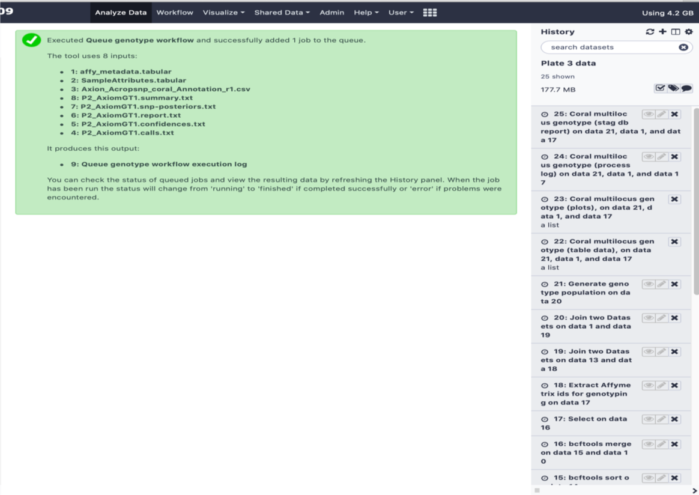
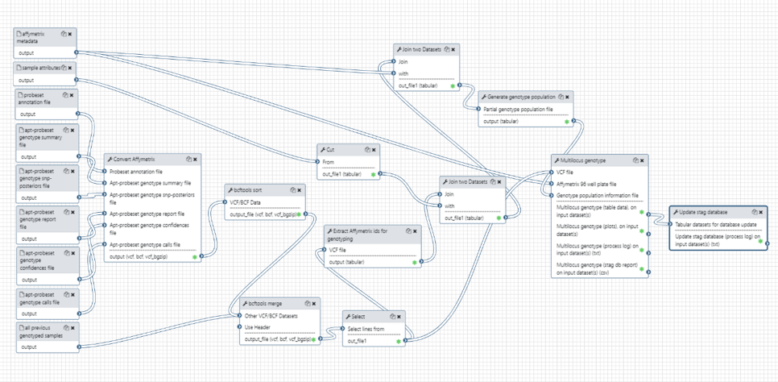
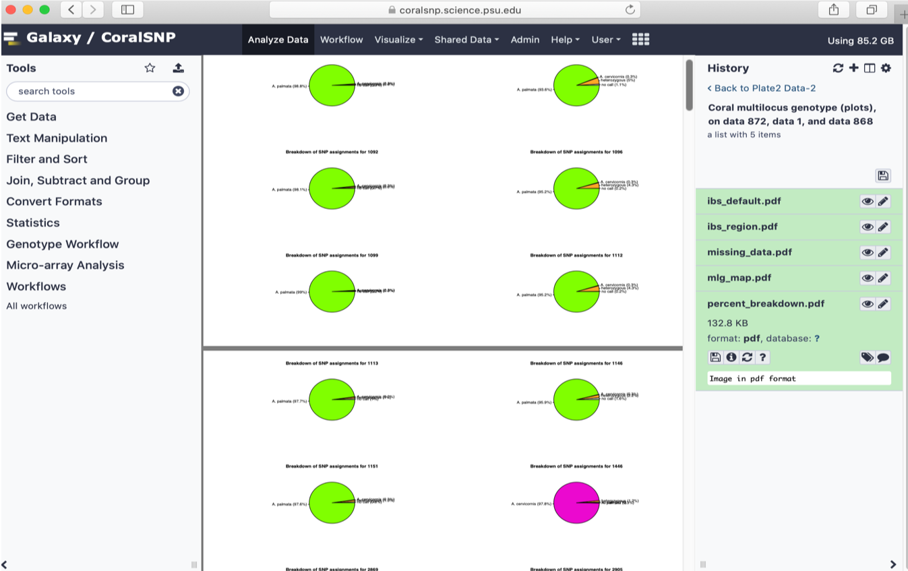

# CoralSNP - a Galaxy analysis environment that includes a 30k SNP genotyping array for Acropora corals and their dinoflagellate symbionts

## Introduction

This document provides information for using the [Galaxy CoralSNP environment](https://coralsnp.science.psu.edu/galaxy)
which is based on the [Galaxy workbench](https://galaxyproject.org/).  A general understanding of Galaxy is required, so please spend some time with the [introductory tutorials](https://training.galaxyproject.org/training-material/topics/introduction) if you are not yet familiar with Galaxy.

The Galaxy CoralSNP environment enables streamlined analysis of the coral SNPchip available from Fisher Scientific to ultimately provide the user with a genet id, converted raw genotyped data, sample relatedness and hybrid status.

The process is straightforward.  Each of the following steps will be discussed in detail in the following sections of this document.

 - A sample metadata file is created by the user from an Excel spreadsheet template for their samples to be analyzed.  A row is entered into the spreadsheet for each sample, and when finished, the spreadsheet is exported from Excel and saved to disk as a tab-delimeted file.
 - The user logs into the Galaxy CoralSNP environment and creates a new, empty history, ideally naming it in a way that associates it with the run being analyzed.
 - The user uploads their sample metadata file along with the necessary raw Affymetrix data files into the Galaxy CoralSNP environment using the *"Upload file"* tool within the *"Get Data"* section of the Galaxy CoralSNP tool panel.
 - The user selects the *"Queue genotype workflow"* tool from the *"Genotype Workflow"* section of the Galaxy CoralSNP tool panel, selects the appropriate files as inputs, and executes the tool.  The tool executes the entire analysis for the samples and the user can view the results in the Galaxy history when the analysis is finished.

## Create the Sample Metadata File

The metadata file for the run describes the samples being analyzed by providing important information about them.  The Baums' Lab website provides an [Excel spreadsheet template](http://baumslab.org/documents/SNPChip/STAG_Metadata_Template_v3.xlsm) that can be downloaded and used for each sample run.  Some of the data is optional - here are some details about the columns in the spreadsheet template.

 - **user_specimen_id** (required) - user-specific identifier for each sample
 - **field_call** (optional) - species identified in the field
 - **bcoral_genet_id** (optional) - the Baums' lab coral genet id, deprecated but remains for backward compability with earlier analyses
 - **bsym_genet_id** (optional) - the Baums' lab symbiont genet id, deprecated but remains for backward compability with earlier analyses
 - **reef** (required) - the name of the reef from which the samples were collected
 - **region** (required) - the geographic region in which the reef is located
 - **latitude** (required) - the latitude (in decimal degrees) where the sample was collected
 - **longitude** (required) - the longitude (in decimal degrees) where the sample was colected
 - **geographic_origin** (optional) - how the geographic coordinates are associated with the sample (must be either "colony" or "reef"), defaults to "reef"
 - **colony_location** (optional) - select list includes apical tip, mid-branch, base, sperm, eggs, larva, symbiont and unknown
 - **depth** (optional) - depth (in meters) from surface where the samples was taken, must be decimal value
 - **disease_resist** (optional) - percent diseased of the parent colony where the sample was taken
 - **bleach_resist** (optional) - percent bleached of the parent colony where the sample was taken
 - **mortality** (optional) - average percent mortality for the genet if known
 - **tle** (optional) - total linear extension growth estimate (mg/cm2/d) if known
 - **spawning** (optional) - whether spawning has been observed from this genotype
 - **collector_last_name** (required) - the last name of the collector
 - **collector_first_name** (required) - the first name of the collector
 - **org** (required) - the organization for which the collector is working
 - **collection_date** (required) - the date (format yyyy-mm-dd) when the sample was collected
 - **contact_email** (required) - the collector's email address
 - **seq_facility** (required) - the facility sequencing the samples
 - **array_version** (optional) - currently only v 1.0 is available
 - **public** (optional) - whether the information about the samples is public, defaults to *"Yes"*
 - **public_after_date** (optional) - the date at which information about the samples can be made public, defaults to the current day
 - **sperm_motility** (required) - percent sperm motility observed
 - **healing_time** (required) - average time in days of recovery after intentional wounding or fragmentation
 - **dna_extraction_method** (optional) - method used to extract the sample's DNA
 - **dna_concentration** (optional) - DNA concentration in ng/ul measured with Qubit or PicoGreen
 - **registry_id** (optional) - coming soon!
 - **result_folder_name** (optional) - folder name of the results
 - **plate_barcode** (optional) - plate barcode

It is crucial that the information in this sample metadata file is correct since the analysis pipeline will store portions of it in both current and future analyses for comparison and other uses.  The Excel spreadsheet doesn't validate the information, so care must be taken when entering the data.

Information about all previous runs is available in the [CoralSNP Reports](https://coralsnp.science.psu.edu/reports).  Users should browse this information before creating their sample metadata file to help ensure that the information is correct.  For example, the collector's name, organization and email, reef name, region, etc should exactly match those entered for previous samples if taken by the same collector, from the same reef, etc.

When the Excel spreadsheet is complete. export the information (tab-separated format) into a disk file.  Naming the file is critical - the word *"metadata"* must be contained within the file name on disk.  For example, if analyzing Plate 2 data, the file could be named *"plate2_metadata.tabular"*, but any file name that includes the string *"metadata*" is fine (e.g., *"affy_metadata.tabular"*).

## Upload the Sample Data to Galaxy CoralSNP for Analysis

You'll have to create an account upon your initial visit to the [Galaxy CoralSNP](https://coralsnp.science.psu.edu/galaxy) environment.  General information about registering and logging into Galaxy is available [here](https://galaxyproject.org/support/account), and can be leveraged for creating a new account in the Galaxy CoralSNP environment for users that have not yet done so.  If logging in for the first time, a new, empty Galaxy history will be created for you.  If you are logging into an existing account, you should create a new, empty history for the samples you're planning to analyze.  Name the history in a way that associates it with your current samples.

It is imperative that a new analysis is performed within a Galaxy history that contains only the dataset items for the run.  Analyses should not be performed within a history that contains any items except for the input datasets for the current run.  The analysis pipeline inspects the current Galaxy history and specifies named items as designated inputs to certain tools within the pipeline, so multiple items with the same name will result in pipeline errors.  In addition, all items within the history must be in the *"ok"* (i.e., *"green"*) state.  History items in a *"queued"*, *"running"* or *"error"* state will result in analysis errors and cause problems for others attempting to perform analyses.  Problematic items can be deleted from a history by clicking the *X* icon in the item, allowing for histories to be "cleaned up" in preparation for performing an analyis.  Wenever possible, items being deleted from a history should be *"permamently deleted"* as this will free up disk space on the Galaxy CoralSNP server.

You can now upload your data for analysis.  A general tutorial for uplaoding data to Galaxy is avaialble [here](https://training.galaxyproject.org/training-material/topics/galaxy-data-manipulation/tutorials/get-data/slides.html#1).

Here is a view of the Galaxy upload form that shows all of the files for what was called *"Plate 2"* of the samples.  Notice that the data type (e.g., *"tabular"*. *"csv"*, *"txt"*, etc) has been selected for each file.  Although not required (Galaxy will auto-detect file formats), this is ideal since it will descrease the time needed to upload all of the data files.  Also notice the names of the files.  With the exception of the *"affy_metadata.tabular"* file which is named by the user, all of the file names are produced by the Affymetrix sequencing process for the samples.  All of these file names are important - as discussed previously, the analysis pipeline specifies these named files as designated inputs to certain tools within the pipeline.

When all of the files have been chosen and the data formats specified, clicking the *"Start"* button will initiate the upload.

## The Galaxy CoralSNP *"Queue genotype workflow"* Tool

After uploading the files, select the *"Queue genotype workflow"* tool from the *"Genotype Workflow"* section of the Galaxy CoralSNP tool panel.  Here is a view of the tool form and the Galaxy history containing the uploaded Plate 2 sample files.  Notice that the Galaxy history contains only the uploaded files, and that all items are in the *"ok"* (i.e., *"green"*) state as discussed previously.  This is essential in order to ensure a successful analysis.

We mentioned previously that the names of the files are important, and the tool form demonstrates this.  Notice the help text below each input selection (e.g., *"The word 'metadata' must be in the file name."*).

Executing this tool invokes the entire analysis pipeline consisting of a complex set processes and components, including 3 separate [Galaxy workflows](https://galaxyproject.org/learn/advanced-workflow/); *"EnsureSynced"*, *"ValidateAffyMetadata"* and *"CoralSNP"*.  The tool shields the complexity of the CoralSNP analysis from the user, and performs its function via the [Galaxy API](https://bioblend.readthedocs.io/en/latest/api_docs/galaxy/all.html).

Here is a view of the Galaxy history soon after the tool is executed.  Notice all of the items in the *"queued"* (i.e., *"grey"*) state - these are jobs associated with tools in the pipeline that are queued for execution.

Executing the *"Queue genotype workflow"* tool initiates the following tasks.

 - The current history is insepected, and the file names of all items are collected
 - The public *"all_genotyped_samples.vcf"* [Galaxy data library](https://galaxyproject.org/data-libraries/) dataset is located and imported into the current Galaxy history
 - The *"EnsureSynced"* Galaxy workflow is located, the appropropriate history items are specified as tool inputs, and the workflow is executed
 - The results of the *"EnsureSynced"* workflow are inspected for errors and if any exist, the analysis is terminated
 - The *"ValidateAffyMetadata"* workflow is located, the appropriate history items are specified as tool inputs, and the workflow is executed
 - The results of the *"ValidateAffyMetadata"* wofkflow are inspected for errors and if any exist, the analysis is terminated
 - The *"CoralSNP"* workflow is located, the appropriate history items are specified as tool inputs, and the workflow is executed
 - The *"stag"* Postgres database is updated with information gathered from the analysis results as the final step of the CoralSNP workflow
 - The results of the *"CoralSNP"* wofkflow are inspected for errors and if any exist, the analysis is terminated
 - The *"all_genotyped_samples.vcf"* Galaxy data library dataset is updated with information gathered from the analysis results

It is imperative that the previously genotyped samples contained within the *"all_genotyped_samples.vcf"* dataset are synchronized with the previously genotypes sample records contained within the *"stag"* database.  The *"EnsureSynced"* workflow performs this task, ensuring that the data contained within these two components is in sync before allowing the analysis to proceed.

To ensure recovery when necessary, the *"stag"* database is exported into a backup text file, and a copy of the *"all_genotyped_samples.vcf"* file is stored before updates occur.  Since both of these components are updated, multiple simultaneous enalyses cannot be performed.  The *"Queue genotype workflow"* tool handles this requirement by ensuring that multiple simultaneous executions are handled serially.  This is done by polling the status of the first execution (by later executions) until it has completed.  Additional simultaneous executions are queued in the order in which they were submitted.  If an analysis ends in an error state with either the *"all_genotyped_samples.vcf"* datasetr or the *"stag"* database updated so that they are no longer in sync, the backup copy of the appropriate component can be used to replace the problematic on in preparation for the next analysis run.

Here is a view of the CoralSNP workflow, the heart of the Galaxy CoralSNP analysis.

As discussed above, the workflow is initialted by the *"Queue genotype workflow"* tool via the Galaxy API.  The workflow consists of the following tools, all of which can be installe dinto a local Galaxy environment from the [Galaxy Tool Shed](https://toolshed.g2.bx.psu.edu/).

 - *"Affy2vcf"* - converts Affymetrix genotype calls and intensity file to VCF format
 - *"bcftools sort"* - sorts BCF files
 - *"bcftools merge"* - merges BCF files
 - *"Extract Affymetrix ids for Genotyping"* - extracts information from a VCF file that contains Affymetrix identifiers and produces a file that contains a subset of the identifiers combined with additional data to generate the genotype population information for use as input to the *"coral_multilocus_genotype"* tool
 - *"Coral Multilocus Genotype"* - renders the unique combination of alleles for two or more loci for each individual
 - *"Update Stag Database"* - updates the *"stag"* database tables from a dataset collection where each item in the collection is a tabular file that will be parsed to insert rows into the a table defined by the name of the file

The *"Coral Myltilocus Genotype"* tool produces the following outputs.

 - *"table data"* - a collection of tabular datasets used to update the *"stag"* database, these can generally be ignored
 - *"plots"* - a collection of PDF datasets that prvide visualizations of the analysis, an example of the *"percent_breakdown.pdf"* is shown below
 - *"stag db report"* - a tabular dataset consisting of important information about the samples
 - *"process log"* - the tool execution log, this can be inspected in case of errors to help discover causes and how to correct them

