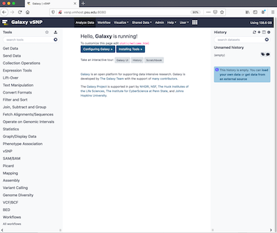
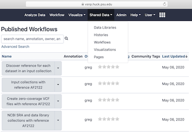
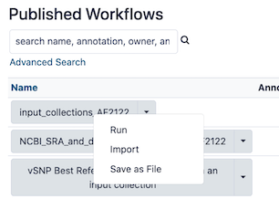
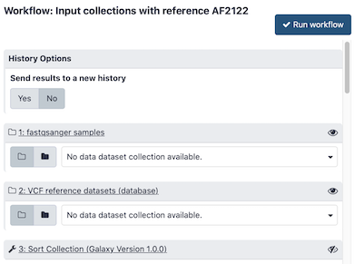
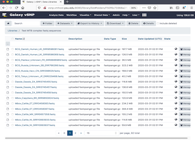
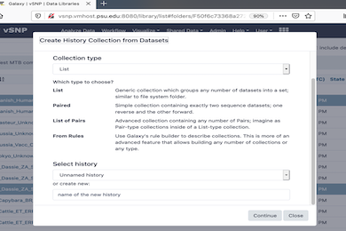
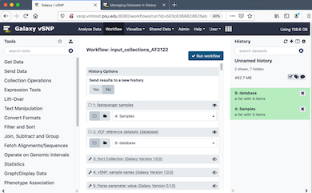

# vSNP - a Galaxy analysis environment that validates SNPs and generates annotated SNP tables and corresponding phylogenetic trees

## Introduction

This document provides information for using the [Galaxy/vSNP environment](https://vsnp.huck.psu.edu/galaxy)
which is based on the [Galaxy workbench](https://galaxyproject.org/).  A general understanding of Galaxy is required, so please spend some time with the [introductory tutorials](https://training.galaxyproject.org/training-material/topics/introduction) if you are not yet familiar with Galaxy.

## Getting Started with Galaxy/vSNP

Galaxy/vSNP provides the Galaxy version of the [vSNP analysis pipeline](https://github.com/USDA-VS/vSNP) which validates SNPs and generates annotated SNP tables and corresponding phylogenetic trees, and, like the vSNP pipeline, is optimized for very large input dataset collections.

New users are required to register, and the details for registering new accounts are available [here](https://galaxyproject.org/support/account/).  When logged in, you’ll see the Galaxy/vSNP splash page, which looks something like this.

## Galaxy/vSNP Published Workflows

Galaxy/vSNP contains several pre-built Galaxy workflows that cover various scenarios for executing the vSNP analysis pipeline.  The workflows are accessed by clicking the Shared Data item in the top menu bar and then selecting the Workflows option.  At the time of this writing, the following 4 pre-built workflows are available.

The feature options available for each workflow are accessed by clicking the down-arrow to the right of each workflow button.  Details for each of these options can be found in the Galaxy workflow tutorials discussed above.  This document focuses on the *Run* option.

Galaxy workflows for analyzing samples for which the reference genome is known include the reference ID (i.e., the Galaxy dbkey) in the workflow name.  So each of the *Input collections with reference AF2122*, *Create zero-coverage VCF files with reference AF2122* and *NCBI SRA and data library collections with reference AF2122* workflows automatically associate the Mycobacterium bovis AF2122 reference with the data in the bwa-mem mapping step during workflow execution.

Some workflows include the vSNP tool to inspect the samples to discover the primary species in those cases where is not known.  The *Discover reference for each dataset in an input collection* workflow is an example.  These workflows will associate the Galaxy dbkey with the data at the bwa-mem mapping step during workflow execution.

## Getting the Input Data

Inputs for Galaxy tools or workflows are taken from the current Galaxy history, and since the current history is empty, no options are available for these input dataset collections.  So for this particular workflow, we have to populate our current history with a collection of fastqsanger sample datasets and another collection of VCF reference datasets.

Galaxy provides several options for populating histories with data.  This [tutorial](https://galaxyproject.org/tutorials/upload/) explains how to do this using the Galaxy upload tool.  If you use this approach to upload your sample datasets to your Galaxy history, make sure to set the datatype to fastqsanger if the files are not gzipped or fastqsanger.gz if the files are gzipped.  These 2 datatypes are the only sample data formats supported by the vSNP tools and workflows, so setting the datatype value to anything else will not work.

If any of your workflow or tool executions end in errors, the first thing to check is the datatype setting for your sample inputs, since incorrect settings are the primary reason for failures.  This [tutorial](https://galaxyproject.org/learn/managing-datasets/) provides all of the details for managing datasets in Galaxy.  Browse it to discover how to change the datatype if you’ve set it incorrectly.

## The Input collections with reference AF2122 Workflow

Clicking the Run option for the workflow named *Input collections with reference AF2122* will display the following form.  The inputs for this workflow are 2 Galaxy dataset collections, the fastqsanger samples and the VCF reference datasets.

For this tutorial, we’ll import our 2 dataset collections from the Galaxy data libraries contained within the Galaxy/vSNP environment.  The data libraries are accessed by clicking the Shared Data item in the top menu bar and then selecting the Data Libraries option.  At the time of this writing, the following 5 Data Libraries are available.

We’ll be analyzing fastqsanger samples, which we can import from either the *71 fastqsanger files for testing* data library or the *Test MTB complex fastq sequences* data library.  We’ll choose the latter.  Click the data library name to access the contents.

Select the datasets for importing by clicking the checkbox to the left of the dataset.  When you’ve completed your selections, click the *Export to History -> as a Collection* option from the top menu bar.

Clicking the *Export to History -> as a Collection* option will display the following form where you can choose a history (the current history is the default) into which to import the collection.  Keep the default Collection type as List and click the Continue button at the bottom of the form.

Clicking the *Continue* button in the above form will display the following form where you can specify the name of your dataset collection of samples.  We’ll name the collection Samples.  Click the *Create list* button after entering the collection name.

After clicking the *Create list* button in the form displayed above, the data library contents page shown above will continue to be displayed.  Now that we have our collection of fastqsanger datasets imported into our history, we’ll next import the VCF reference dataset collection into the same history.

To return to the Data Libraries main page displayed above, click the Libraries link to the left of the current data library name

At the time of this writing, the 3 data libraries that contain VCF reference datasets are named *1288 vcf files for testing*, *Bovis_AF2122_reference* and *TB_complex_AF2122_reference*.  We’ll use the *TB_complex_AF2122_reference* data library for this tutorial.  Click the data library name to display the contents, proceed to select datasets and import the collection into your current history in the same way described above for the fastqsanger samples dataset collection.  Name the dataset collection "database".   When finished, click the *Analyze Data* option in the top menu bar...

...and you’ll find that your current history now includes the 2 dataset collections that we just imported from the data libraries.

Now that our history is populated with the required inputs, we can return to running the *input_collections_AF2122* workflow displayed above.  We are now able to select the appropriate collection for each workflow input.  Make sure to set the correct selection for each input, and then click the *Run workflow* button in the upper right corner of the form.

Clicking the *Run workflow* button in the form will execute the workflow and populate the history with the outputs of each tool.

As each job completes, the associated history item will pass through 3 colored phases, queued (grey), running (yellow) and completed (green, or red if in error).  When the workflow is completed, the results of the final tools (which are the most interesting) can be viewed.  These tools are the *Best-scoring ML Tree* and *vSNP: build tables* history items shown here.

To view the phylogenetic tree, click on the *Best-scoring ML Tree* label to display the list elements.  In our case the input dataset collections we used produced a list consisting of only a single element.  Click on the element label to open the history item to access the feature icons.

The phylogenetic tree van be viewed by clicking the Visualization icon in the lower left icon panel of the history item.

Clicking the icon will display all Visualization tools that can be used to view the tree.

The vSNP phylogenetic trees can only be view with the Phyloviz tool.  Selecting that tool by clicking on it will display the tree for the history item.

To view the Excel table, click on the *vSNP: build tables* label to display the list elements.  In our case the input dataset collections we used produced a list consisting of 2 elements.  Click on the element label to open the history item to access the feature icons.

The Excel table can be viewed by clicking the eyeball icon in the upper right corner of the history item.

If using the Firefox Browser, clicking the icon will popup the following alert dialog.

Click the *OK* button to display the Excel table in an Excel spreadsheet.

Some browsers (e.g., Safari) may be configured to download the Excel table instead of displaying it as shown above.  When using these browsers, you can open the downloaded file in Excel.

